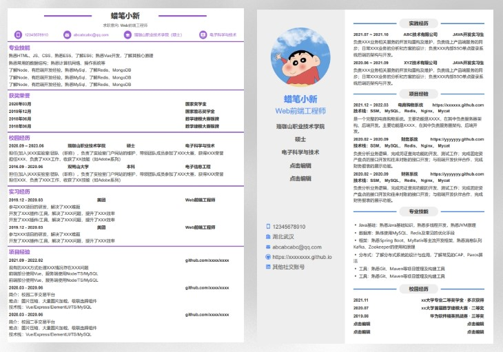

# 风植在线简历🧩
> 一款在线简历编辑、生成工具，哪里要改点哪里，妈妈再也不用担心我的简历~
>
> **技术栈：「Vue2(vuex) + ElementUI + jsoneditor + jspdf」**
> 
> **立即体验👉 [>点我点我<](https://elmmmm.github.io/fengzhi-resume/)**
## 功能特点
- 🎯哪里要改点哪里，简单易用
- 📐实时预览、实时同步修改，所见即所得
- 🎨简约清新主题和模板
- 🧶导出PDF，保留JSON
- 🎏......

### 现有模板
两个😂



### 源码使用
>基于 vue-cli 脚手架构建
```
# 安装依赖
npm i

# 运行项目
npm run serve

# 打包
npm run build
```
See [vue-cli Configuration Reference](https://cli.vuejs.org/config/).
